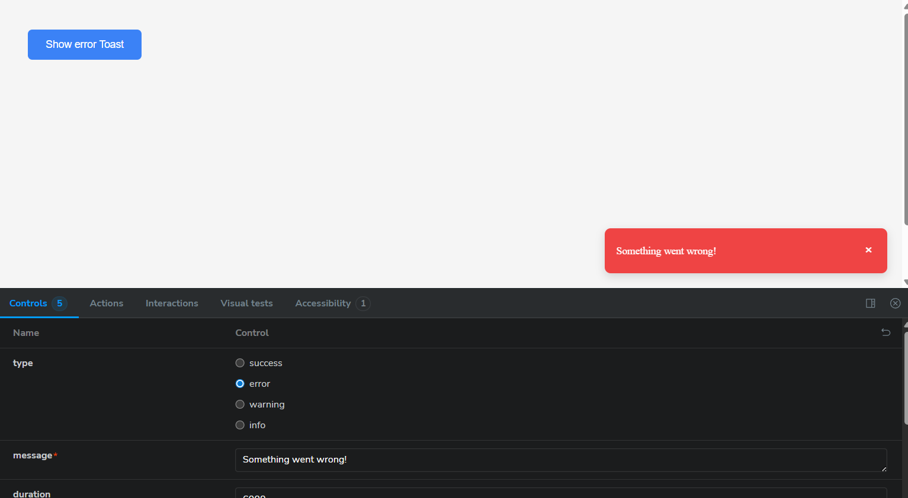

# React Component Library with Storybook

## Description

This project is a small React UI component library built with React + TypeScript and Storybook support.  
It includes the Input, Toast, and Sidebar Menu components.

Styled Components are used for efficient and scalable component styling.

## How to Run

1. Clone the repository:  
   `git clone <https://github.com/pavlo1377/react-component-library.git>`
2. Install dependencies:  
   `npm install`
3. Start Storybook:  
   `npm run storybook`
4. Open http://localhost:6006 in your browser.

## Components

- **Input** — versatile input supporting multiple types, password visibility toggle, and clear button.
- **Toast** — animated notification with auto-dismiss timer.
- **Sidebar Menu** — sidebar menu with nested items and animations.

## Screenshots

### Input

Input

Input Clearable

Input Password Toggle

Toggled Password

### Toast

Toast

Toast Success

Toast Error

Toast Warning

Toast Info

Toast Not Closable

Toast Multiple

### Sidebar Menu

Sidebar

Sidebar Open State

Sidebar One Level

Sidebar Multiple Levels

### Storybook UI

Storybook UI

## Additional Features

- ESLint and Prettier configured for code quality and consistency
